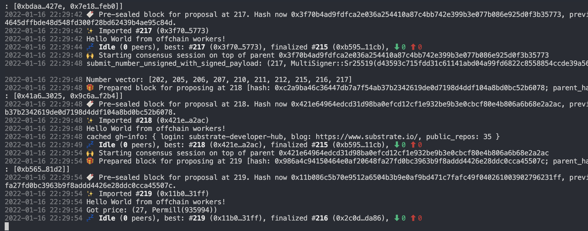
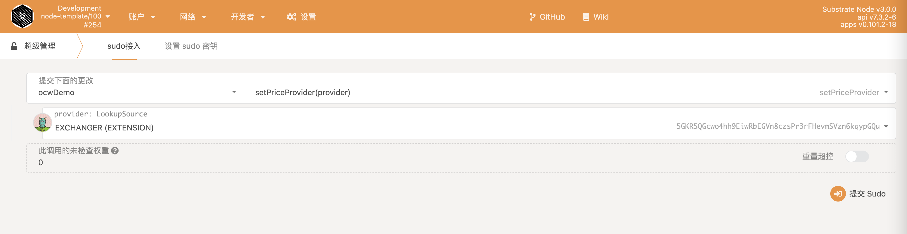
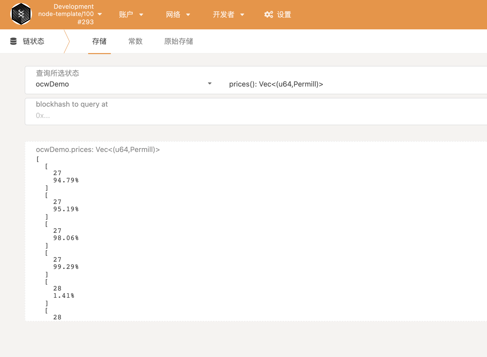

# OCW

## RUN

```sh
cargo build --release

cargo run --release -- --dev --tmp
```



## PRICE



## KEY

```sh
curl http://127.0.0.1:9933 -H "Content-Type:application/json;charset=utf-8" -X POST --data '{"jsonrpc":"2.0","id":1,"method":"author_insertKey","params": ["demo", pub hex, pri hex]}'
```

## ONCHAIN

